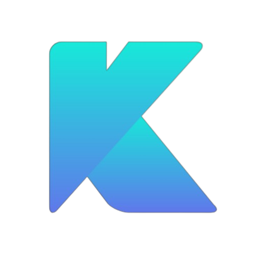
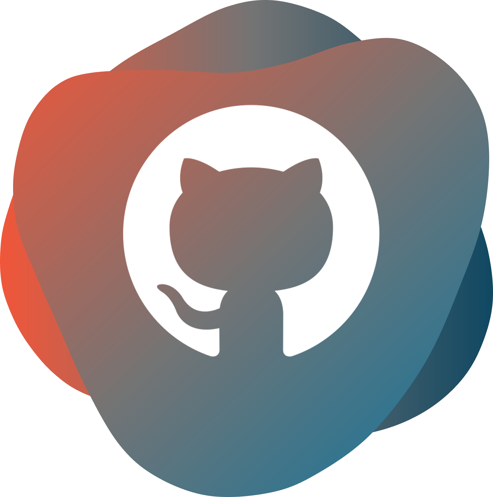
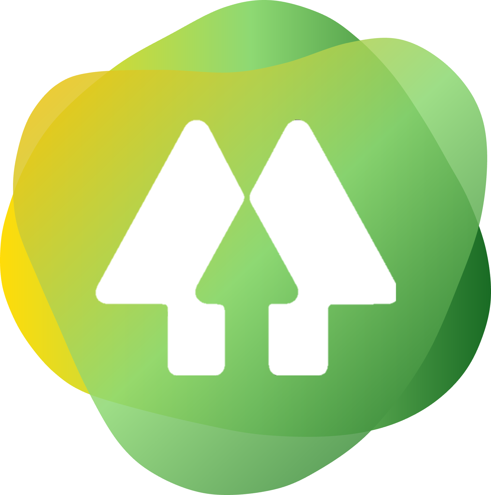
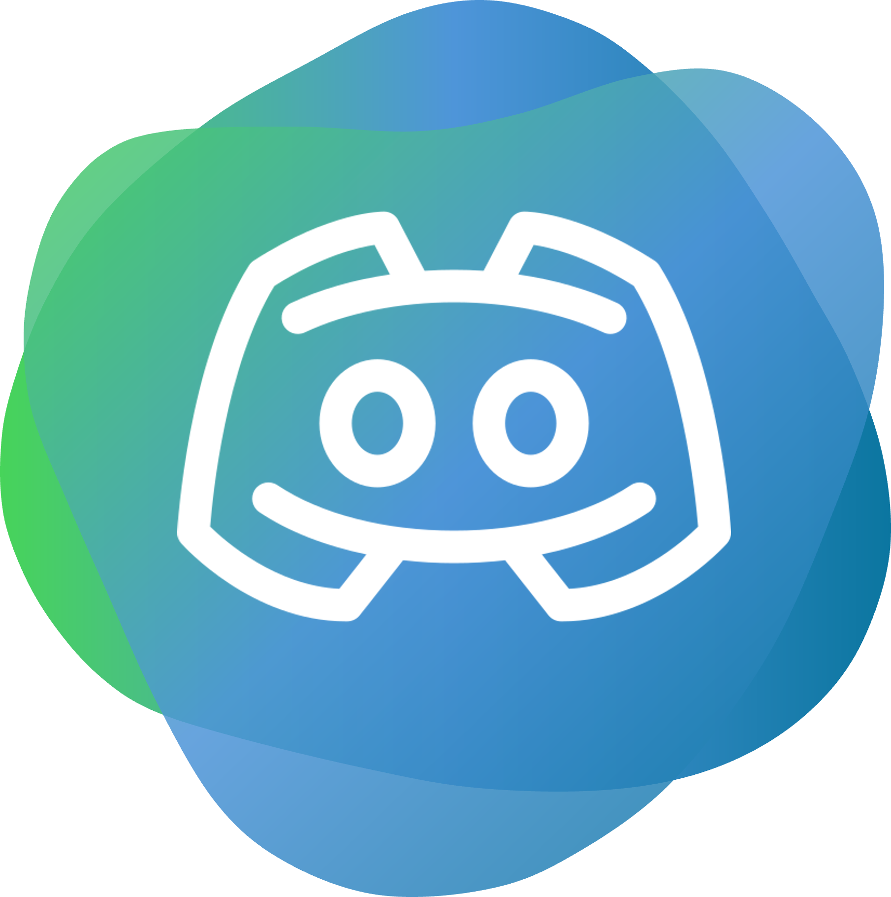

<!--Banner-->
<!-- 

<!--Night Owl image-->

  

<!--Header Name-->
<h1 style="border-bottom: 0px !important">&nbsp; ʜɪ, Kᴠᴇxɪᴜᴍ ʜᴇʀᴇ!</h1>

<strong>ᴋᴠᴇxɪᴜᴍ ᴜɢ</strong> ɪꜱ ᴀ ꜱᴍᴀʟʟ, ᴅᴇᴅɪᴄᴀᴛᴇᴅ ᴛᴇᴀᴍ ꜰᴏᴄᴜꜱᴇᴅ ꜱᴏʟᴇʟʏ ᴏɴ ᴛʜᴇ ᴅᴇᴠᴇʟᴏᴘᴍᴇɴᴛ ᴏꜰ ᴛʜᴇ ɪɴɴᴏᴠᴀᴛɪᴠᴇ ᴘʀᴏɢʀᴀᴍᴍɪɴɢ ʟᴀɴɢᴜᴀɢᴇ <strong>ᴋᴠᴇxɪᴜᴍ</strong>. ʟᴇᴅ ʙʏ <a href="https://github.com/kuhlklay">ᴋᴜʜʟᴋʟᴀʏ</a> [ ᴏɴʟʏ ɢᴏᴏᴅ ᴀᴛ ᴘʀᴏɢʀᴀᴍᴍɪɴɢ ɪʀʀᴇʟᴇᴠᴀɴᴛ ꜱᴛᴜꜰꜰ シ ], ᴏᴜʀ ᴍɪꜱꜱɪᴏɴ ɪꜱ ᴛᴏ ᴘᴜꜱʜ ᴛʜᴇ ʙᴏᴜɴᴅᴀʀɪᴇꜱ ᴏꜰ ᴍᴏᴅᴇʀɴ ᴘʀᴏɢʀᴀᴍᴍɪɴɢ ʙʏ ᴄʀᴇᴀᴛɪɴɢ ᴀ ʟᴀɴɢᴜᴀɢᴇ ᴛʜᴀᴛ ʙᴀʟᴀɴᴄᴇꜱ ᴘᴏᴡᴇʀ, ᴘʀᴇᴄɪꜱɪᴏɴ, ᴀɴᴅ ᴇxᴘʀᴇꜱꜱɪᴠᴇ, ᴋɪɴᴅ ᴏꜰ ɪɴɴᴏᴠᴀᴛɪᴠᴇ ᴀɴᴅ ɴᴇᴡ ꜱʏɴᴛᴀx. ᴡᴇ ᴀʀᴇ ᴘᴀꜱꜱɪᴏɴᴀᴛᴇ ᴀʙᴏᴜᴛ ᴘʀᴏᴠɪᴅɪɴɢ ᴅᴇᴠᴇʟᴏᴘᴇʀꜱ ᴡɪᴛʜ ᴛʜᴇ ᴛᴏᴏʟꜱ ᴛʜᴇʏ ɴᴇᴇᴅ ᴛᴏ ꜱᴏʟᴠᴇ ᴄᴏᴍᴘʟᴇx ᴘʀᴏʙʟᴇᴍꜱ ᴇꜰꜰɪᴄɪᴇɴᴛʟʏ ᴀɴᴅ ᴇꜰꜰᴇᴄᴛɪᴠᴇʟʏ.

<table border="1">
    <tr>
        <th>Cᴀᴛᴇɢᴏʀʏ</th>
        <th>Nᴀᴍᴇꜱ ᴏꜰ Cᴏɴᴛʀɪʙᴜᴛᴏʀꜱ</th>
    </tr>
    <tr>
        <td><strong>ꜰᴏᴜɴᴅᴇʀ</strong></td>
        <td><a href="https://github.com/kuhlklay">Kᴜʜʟᴋʟᴀʏ</a></td>
    </tr>
    <tr>
        <td><strong>ʟᴀɴɢᴜᴀɢᴇ ᴅᴇꜱɪɢɴ</strong></td>
        <td><a href="https://github.com/kuhlklay">Kᴜʜʟᴋʟᴀʏ</a></td>
    </tr>
    <tr>
        <td><strong>ʟɪʙʀᴀʀɪᴇꜱ</strong></td>
        <td><a href="https://github.com/kuhlklay">Kᴜʜʟᴋʟᴀʏ</a></td>
    </tr>
</table>

  

<!-- <h2 align="center">ミ Lᴀɴɢᴜᴀɢᴇꜱ ᴀɴᴅ Tᴏᴏʟꜱ 彡</h2>

<table>
  <tr>
    <th>Lᴀɴɢᴜᴀɢᴇꜱ</th>
    <th>Tᴏᴏʟꜱ</th>
  </tr>
  <tr>
    <td>
      

        
        
        
        
        
        
        
        
      

    </td>
    <td>
      asd
    </td>
  </tr>
</table>

Profile Count Badge

  

 -->

---

<!--Trophies Section-->   
<!-- <h2 align="center">ミ Gɪᴛʜᴜʙ Tʀᴏᴘʜɪᴇs 彡</h2>

  <a href="https://github.com/Kvevcium">
    <picture>
      <source media="(prefers-color-scheme: dark)" srcset="https://github-profile-trophy.vercel.app/?username=Kvevcium&no-bg=true&row=2&column=6&margin-w=20&margin-h=20&theme=monokai">
      <source media="(prefers-color-scheme: light)" srcset="https://github-profile-trophy.vercel.app/?username=Kvevcium&no-bg=true&row=2&column=6&margin-w=20&margin-h=20">
      
    </picture>
  </a>

  -->

<!--Github stats Table--> 
<h2 align="center">ミ Gɪᴛʜᴜʙ Sᴛᴀᴛs 彡</h2>

<!-- <table width="100%">
  <tr>
    <td width="50%">
      <h3 align="center"><strong>Gɪᴛʜᴜʙ Sᴛᴀᴛs</strong></h3>
      

        
      

    </td>
    <td width="50%">
      <h3 align="center"><strong>Sᴛʀᴇᴀᴋ Sᴛᴀᴛs</strong></h3>
      

        
      

    </td>
  </tr>
  <!-- <tr>
    <td width="50%">
      <h3 align="center"><strong>Lᴀᴛᴇsᴛ Pʀᴏᴊᴇᴄᴛ</strong></h3>
      

        
      

    </td>
    <td width="50%">
      <h3 align="center"><strong>Tᴏᴘ Cᴏɴᴛʀɪʙᴜᴛɪᴏɴs</strong></h3>
      

        
      

    </td>
  </tr> -->
<!-- </table>
  --> 

<!-- 

 

<!--Contribution Graph-->
<!-- <h2 align="center">ミ Cᴏɴᴛʀɪʙᴜᴛɪᴏɴ Gʀᴀᴘʜ 彡</h2>

    

 -->

---

<!--Contact Section--> 

<h2 align="center">ミ Cᴏɴᴛᴀᴄᴛ 彡</h2>

  

 

<!--Buy me a coffee-->
<!-- 

<!--Footer--> 
<!-- 

  

